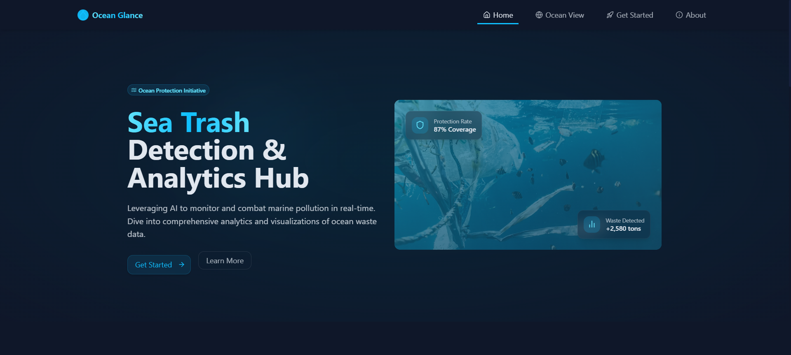
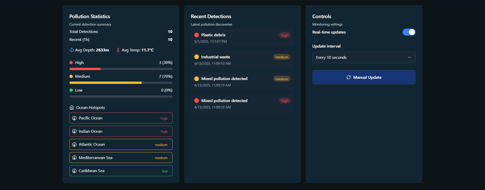

# AI-Powered Vision for Underwater Waste Detection.

An AI-powered underwater trash detection application that uses advanced computer vision to identify marine debris in images and videos. The system includes a modern React frontend and Python FastAPI backend.

## 🖼 Screenshots

### HomePage


### Ocean-View Panel


### Analytics 


## Features

- **Single Image Processing**: Upload and analyze individual underwater images to detect trash
- **Multiple Frame Processing**: Convert a series of images into a video with trash detection
- **Visualization**: View detection results with bounding boxes and confidence scores
- **Analytics**: Review detection statistics and categorization of marine debris
- **Media Gallery**: Browse and download previously processed videos

## Tech Stack

### Frontend
- React with TypeScript
- TailwindCSS for styling
- ShadCN UI components
- Framer Motion for animations

### Backend
- Python FastAPI
- YOLO for object detection
- OpenCV for image processing
- Ultralytics ML framework

## Prerequisites

Before installation, make sure you have the following installed:

- Node.js (v14+)
- npm or yarn
- Python (v3.8+)
- pip (Python package manager)
- Git

## Installation

### 1. Clone the Repository

```bash
git clone https://github.com/yourusername/sea-trash-detection.git
cd sea-trash-detection
```

### 2. Backend Setup

#### Install Python Dependencies

```bash
# Create and activate a virtual environment (recommended)
python -m venv venv
source venv/bin/activate  # On Windows: venv\Scripts\activate

# Install required packages
pip install ultralytics fastapi python-multipart uvicorn pillow opencv-python imageio
```

#### Download the YOLO Model

The system requires the YOLO model file (`best.pt`) to be in the root directory. If you don't have it yet:

1. Download the model from [this link](https://download-link-for-model.com) (replace with actual link)
2. Place it in the project root directory

Alternatively, if you have your own trained model, make sure it's named `best.pt` and place it in the root directory.

### 3. Frontend Setup

Install npm dependencies:

```bash
npm install
```

## Configuration

### Backend Configuration

The backend server runs on port 8000 by default. You can modify this in `main.py` if needed.

### Frontend Configuration

The frontend connects to the backend API at `http://localhost:8000` by default. If you need to change this:

1. Edit `src/lib/api.ts`
2. Update the `API_BASE_URL` constant to your desired URL

## Running the Application

You have multiple options to run the application:

### Option 1: Combined Start (Recommended for Development)

This starts both frontend and backend simultaneously:

```bash
node server.js
```

### Option 2: Separate Terminals

#### Terminal 1 (Backend):
```bash
# Activate virtual environment if you created one
source venv/bin/activate  # On Windows: venv\Scripts\activate

# Start the FastAPI server
uvicorn main:app --reload
```

#### Terminal 2 (Frontend):
```bash
npm run dev
```

### Option 3: Production Build

For a production-ready frontend build:

```bash
npm run build
```

This creates optimized files in the `dist` directory that can be served by any static file server.

## Usage Guide

1. Open your browser and navigate to http://localhost:5173 (frontend) or the port shown in your terminal
2. Click "Get Started" on the homepage to access the detection tool
3. Choose the detection method:
   - **Single Image**: Upload one image for immediate analysis
   - **Multiple Frames**: Upload multiple images to create a video
4. Adjust the confidence threshold to filter detections
5. For video creation, set the desired frames per second (FPS)
6. View results with bounding boxes indicating detected objects
7. Processed videos appear in the "Recent Processed Videos" section
8. Download or share processed media using the available controls

## Folder Structure

```
sea-trash-detection/
├── src/                  # Frontend source code
│   ├── components/       # React components
│   ├── lib/              # Utilities and API client
│   └── pages/            # Application pages
├── videos/               # Processed video storage
├── main.py               # FastAPI backend
├── server.js             # Combined dev server
├── setup_server.js       # Setup script
└── best.pt               # YOLO model file
```

## Troubleshooting

### Common Issues

#### Backend server fails to start

- Check if Python dependencies are installed correctly
- Verify that the `best.pt` model file exists in the root directory
- Make sure port 8000 is not already in use by another application

#### Video not displaying

- Check the browser console for errors
- Make sure the `videos` directory exists and is writable
- Verify that the CORS settings in `main.py` allow your frontend origin

#### Image processing fails

- Check if the uploaded image format is supported
- Verify that the YOLO model is loaded correctly
- Increase timeout settings if processing large images

## License

This project is licensed under the MIT License - see the LICENSE file for details.

## Acknowledgments

- YOLO model: [Ultralytics](https://github.com/ultralytics/yolov5)
- Ocean images: [Unsplash](https://unsplash.com/)
